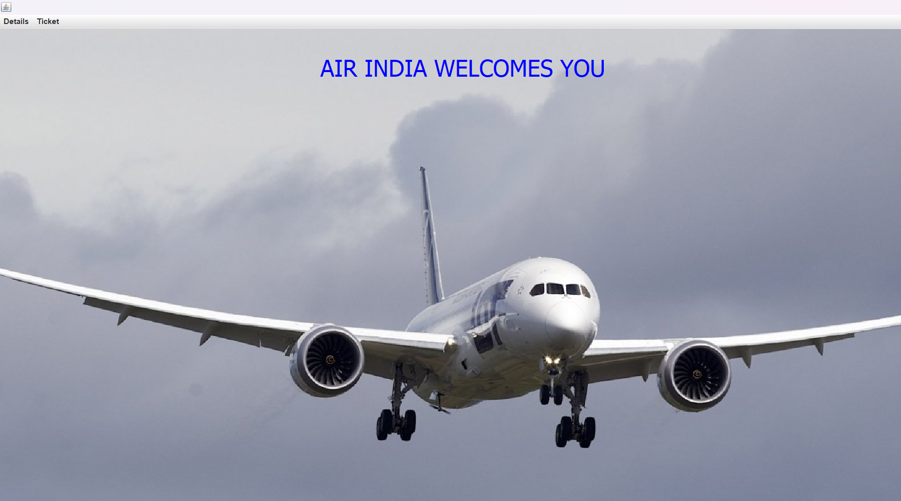
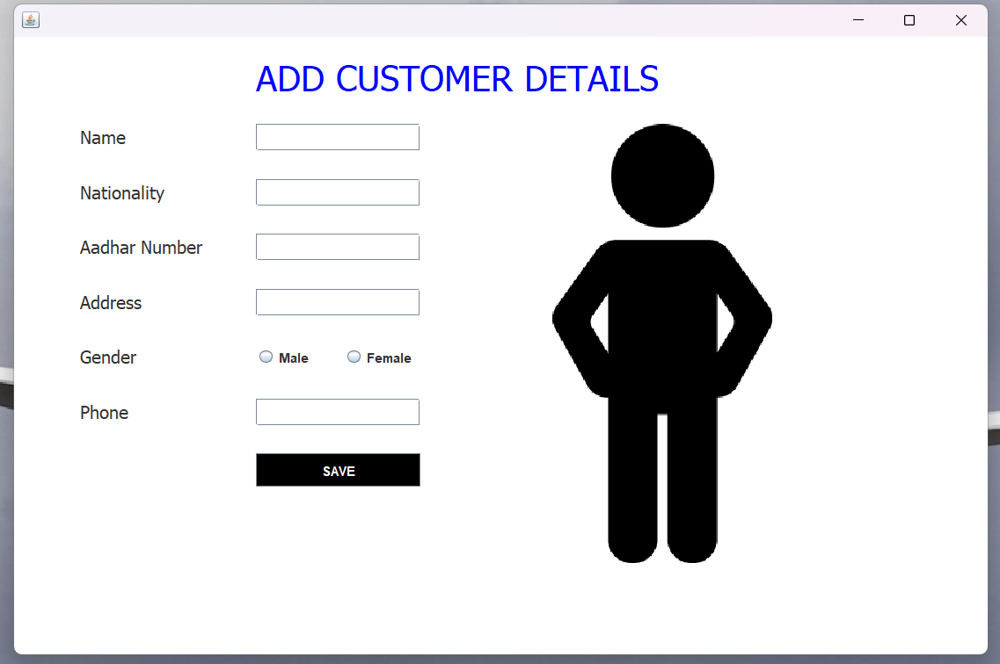
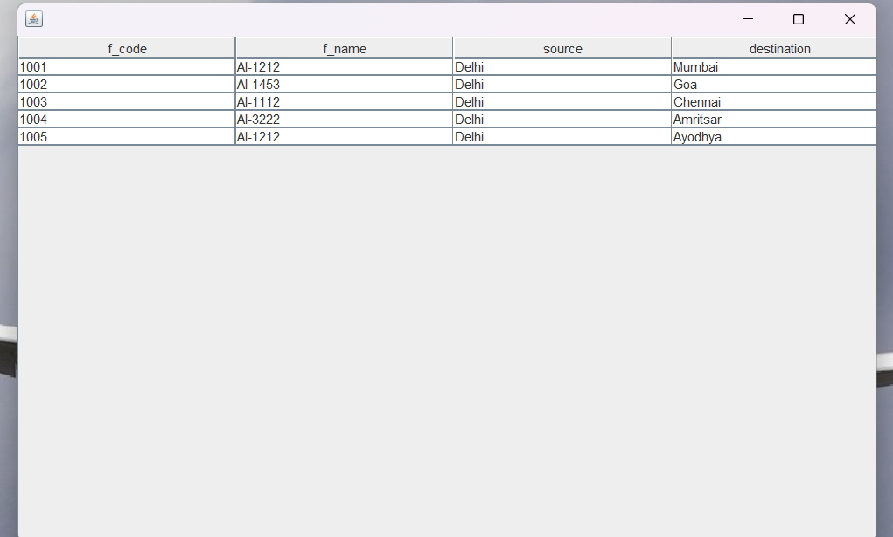
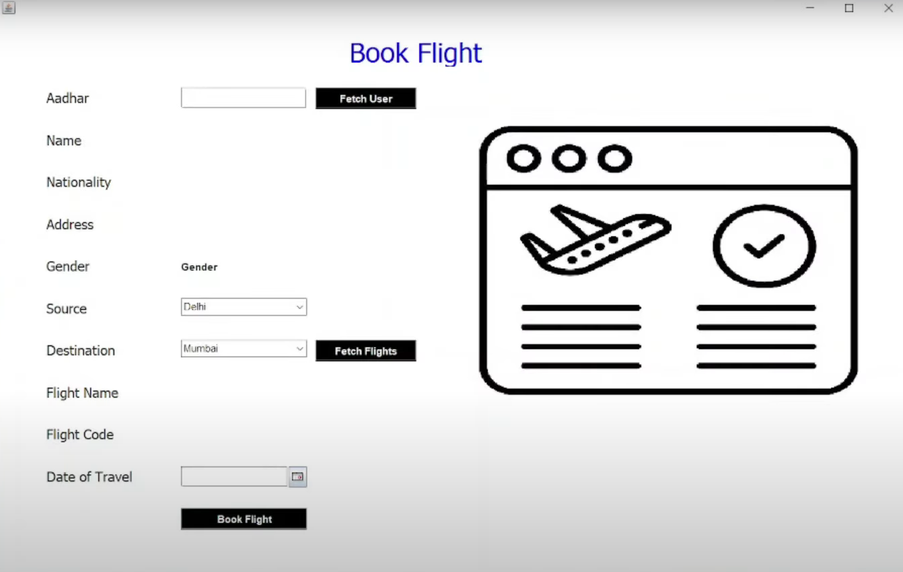
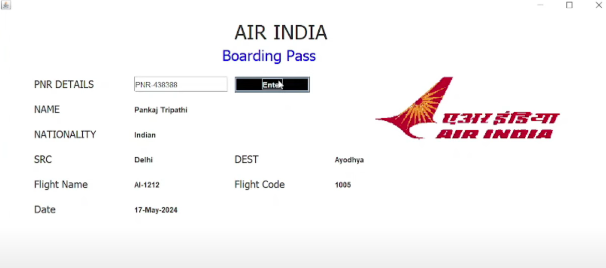
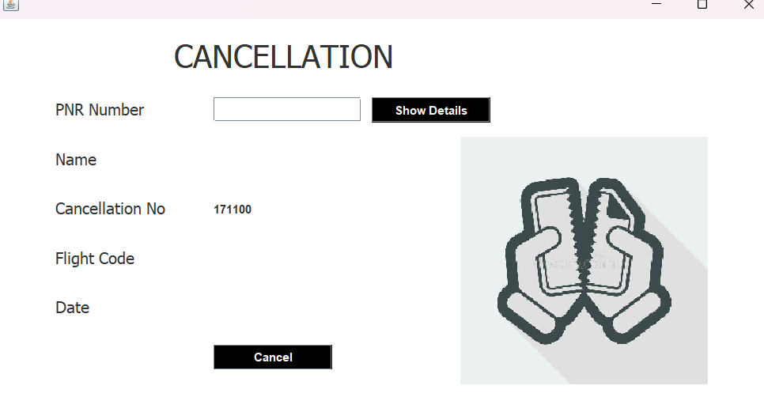

# AirlineManagementSystem
The **Airline Management System** automates the registration and management process of airlines. It manages passenger details, flight information, reservations, payments, and cancellations. The system uses **Java Swing** for the frontend and **MySQL** for the backend, providing a reliable and efficient solution for airline operations.

## Features
- **Flight Management**: Manage flight schedules, routes, and seat availability.  
- **Booking System**: Allows passengers to book tickets, view available flights, and manage reservations.  
- **User Authentication**: Secure login and registration for passengers and staff.  
- **Admin Dashboard**: Enables airline administrators to manage flights, view bookings, and generate reports.  

---

## Technologies Used
- **Backend**: Java  
- **Frontend**: HTML, CSS  
- **Database**: MySQL  

---

## Getting Started

### Prerequisites
- Java JDK 8 or higher  
- MySQL Database  
- IDE like Eclipse or IntelliJ IDEA  

### Installation
1. Clone the repository:  
   ```bash
   git clone https://github.com/Krushna154/AirlineManagementSystem.git
   ```  
2. Open the project in your preferred IDE.  
3. Set up the MySQL database:  
   ```sql
   CREATE DATABASE airlinemanagementsystem;
   USE airlinemanagementsystem;
   ```  
4. Import the provided SQL script (if any) to create the necessary tables.  
5. Run the project and use the GUI to access all features.  

---
# My Project Screenshots

This section provides a visual overview of the different screens in the application.

---

### **Mainframe**
This is the main screen or homepage of the application.


---

### **Add Customer**
This screen is used to add new customer information.


---

### **Flight Info**
This screen displays detailed information about a specific flight.


---

### **Book Flight**
Use this screen to book a new flight.


---

### **Boarding Pass**
This screen shows the generated boarding pass for a booked flight.


---

### **Cancellation**
This screen is for canceling a flight booking.


---


## Future Enhancements
- Integration with a payment gateway for online ticket booking (e.g., Razorpay, Paytm, Instamojo)  
- Email/SMS notifications for bookings  
- Flight search and filter functionality  

---

## Author
**Krushna Sangale**  
- GitHub: [Krushna154](https://github.com/Krushna154)
